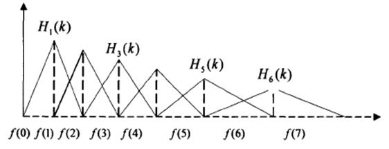

# 参考文档
<https://my.oschina.net/jamesju/blog/193343>

# MFCC介绍

在语音识别（Speech Recognition）和话者识别（Speaker Recognition）方面，最常用到的语音特征就是梅尔倒谱系数（Mel-scale Frequency Cepstral Coefficients，简称MFCC）。<!--more-->

人们从低频到高频这一段频带内按临界带宽的大小由密到疏安排一组带通滤波器，对输入信号进行滤波。将每个带通滤波器输出的信号能量作为信号的基本特征，对此特征经过进一步处理后就可以作为语音的输入特征。
	
由于这种特征不依赖于信号的性质，对输入信号不做任何的假设和限制，又利用了听觉模型的研究成果。因此，这种参数比基于声道模型的LPCC相比具有更好的鲁邦性，更符合人耳的听觉特性，而且当信噪比降低时仍然具有较好的识别性能。
	
梅尔倒谱系数（Mel-scale Frequency Cepstral Coefficients，简称MFCC）是在Mel标度频率域提取出来的倒谱参数，Mel标度描述了人耳频率的非线性特性，它与频率的关系可用下式近似表示：

$$Mel(f) = 2595\times lg(1+\frac{f}{700})$$

式中f为频率，单位为Hz。

# 语音特征参数MFCC提取过程

1. 预加重

	$$H(z) = 1-\mu z^{-1}$$

	预加重处理其实是将语音信号通过一个高通滤波器，式中μ的值介于0.9-1.0之间，我们通常取0.97。预加重的目的是提升高频部分，使信号的频谱变得平坦，保持在低频到高频的整个频带中，能用同样的信噪比求频谱。同时，也是为了消除发声过程中声带和嘴唇的效应，来补偿语音信号受到发音系统所抑制的高频部分，也为了突出高频的共振峰。

1. 分帧

	N个采样点集合成一个观测单位，称为帧。通常情况下N的值为256或512，涵盖的时间约为20~30ms左右。为了避免相邻两帧的变化过大，因此会让两相邻帧之间有一段重叠区域，此重叠区域包含了M个取样点，通常M的值约为N的1/2或1/3。通常语音识别所采用语音信号的采样频率为8KHz或16KHz，以8KHz来说，若帧长度为256个采样点，则对应的时间长度是256/8000×1000=32ms。

1. 加窗

	将每一帧乘以汉明窗，以增加帧左端和右端的连续性。假设分帧后的信号为S(n), n=0,1…,N-1, N为帧的大小，那么乘上汉明窗后

	$${S}'(n) = S(n)\times W(n)$$

	W(n)形式如下：

	$$W(n,a)=(1-a)-a\times cos\left [\frac{2\pi n}{N-1}\right ], 0\leq n\leq N-1$$

	不同的a值会产生不同的汉明窗，一般情况下a取0.46

1. 快速傅里叶变换

	由于信号在时域上的变换通常很难看出信号的特性，所以通常将它转换为频域上的能量分布来观察，不同的能量分布，就能代表不同语音的特性。所以在乘上汉明窗后，每帧还必须再经过快速傅里叶变换以得到在频谱上的能量分布。
	
	对分帧加窗后的各帧信号进行快速傅里叶变换得到各帧的频谱。并对语音信号的频谱取模平方得到语音信号的功率谱。设语音信号的DFT为：

	$$X\_a(k)=\sum_{n=0}^{n-1}x(n)e^{-j2\pi k/n}, 0\leq k \leq N$$
	
	式中x(n)为输入的语音信号，N表示傅里叶变换的点数。

1. 三角带通滤波器

	将能量谱通过一组Mel尺度的三角形滤波器组，定义一个有M个滤波器的滤波器组（滤波器的个数和临界带的个数相近），采用的滤波器为三角滤波器，中心频率为f(m),m=1,2,...,M。M通常取22-26。各f(m)之间的间隔随着m值的减小而缩小，随着m值的增大而增宽，如图所示：
	
	
	
	三角滤波器的频率响应定义为:
	
	$$\begin{cases}
	0 & \text{ , } k<f(m-1) \\\
	\frac{2(k-f(m-1))}{(f(m+1)-f(m-1))(f(m)-	f(m-1))} & \text{ , } f(m-1)\leq k \leq f(m) 	\\\ 
	\frac{2(f(m+1)-k)}{(f(m+1)-f(m-1)(f(m)-	f(m-1)))} & \text{ , } f(m)\leq k \leq f(m+1) 	\\\ 
	0 & \text{ , } k \geq f(fm+1) 
	\end{cases}$$

	式中
	
	$$\sum_{m=0}^{M-1}H_m(k)=1$$
	
	三角带通滤波器有两个主要目的：
	1. 对频谱进行平滑化，并消除谐波的作用，突显原先语音的共振峰。（因此一段语音的音调或音高，是不会呈现在 MFCC 参数内，换句话说，以MFCC为特征的语音辨识系统，并不会受到输入语音的音调不同而有所影响）
	1. 降低运算量。

1. 计算每个滤波器组输出的对数能量

	$$s(m)=ln(\sum_{k=0}^{N-1} \left|X_a(k) \right|^2H_m(k)),0\leq m \leq M$$
	
1. 经离散余弦变换（DCT）得到MFCC系数

	$$C(n) = \sum_{m=0}^{N-1}s(m)cos\left(\frac {\pi n(m-0.5)}{M} \right ),n=1,2,...,L$$
	
	将上述的对数能量带入离散余弦变换，求出L阶的Mel-scale Cepstrum参数。L阶指MFCC系数阶数，通常取12-16。这里M是三角滤波器个数
	
1. 对数能量

	一帧的音量（即能量），也是语音的重要特征，而且非常容易计算。因此，通常再加上一帧的对数能量（定义：一帧内信号的平方和，再取以10为底的对数值，再乘以10）使得每一帧基本的语音特征就多了一维，包括一个对数能量和剩下的倒频谱参数。
	
1. 动态差分参数的提取（包括一阶差分和二阶差分）

	标准的倒谱参数MFCC只反映了语音参数的静态特性，语音的动态特性可以用这些静态特征的差分谱来描述。实验证明：把动、静态特征结合起来才能有效提高系统的识别性能。差分参数的计算可以采用下面的公式：
	
	$$d\_t =
	\begin{cases}
	C\_{t+1}-C\_t & \text{ , } t<K \\\ 
	\frac {\sum\_{k=1}^K\ k(C \_{t+k}\ -C\_{t-k}\ \ )}	{\sqrt{2\sum\_{k=1}^K\ k^2}} & \text{ , } others \\\
	C\_t-C\_{t-1} & \text{ , } t \geq Q-K 
	\end{cases}
	$$
	
	式中,$d_t$表示第t个一阶差分，$C_t$表示第t个倒谱系数，Q表示倒谱系数的阶数，K表示一阶导数的时间差，可取1或2。将上式的结果再代入就可以得到二阶差分的参数。
	
# 总结

因此，MFCC的全部组成其实是：

$$N维MFCC参数+帧能量$$

其中$N维MFCC参数$包括

$$N/3维MFCC系数+ N/3维一阶差分参数+ N/3维二阶差分参数$$

$帧能量$可根据需求替换

