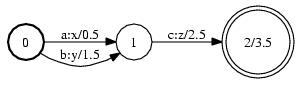

# OpenFst Library
* OpenFst is a library for constructing, combining, optimizing, and searching weighted finite-state transducers (FSTs,有限状态机)<!-- more -->
* Weighted finite-state transducers are automata where each transition has an input label, an output label, and a weight.
* Finite-state acceptors are used to represent sets of strings (specifically, regular or rational sets); 
* finite-state transducers are used to represent binary relations between pairs of strings (specifically, rational transductions). 
* The weights can be used to represent the cost of taking a particular transition.
* FSTs have key applications in speech recognition and synthesis, machine translation, optical character recognition, pattern matching, string processing, machine learning, information extraction and retrieval among others.
* Often a weighted transducer is used to represent a probabilistic model (e.g., an n-gram model, pronunciation model).

# OpenFst Quick Tour
## Example FST
The following picture depicts a finite state transducer:


* The initial state is label 0. There can only be one initial state.
* The final state is 2 with final weight of 3.5. Any state with non-infinite final weight is a final state.
* There is an arc (or transition) from state 0 to 1 with input label a, output label x, and weight 0.5.
* This FST transduces, for instance, the string ac to xz with weight 6.5 (the sum of the arc and final weights).

## Creating FSTs
1. Creating FSTs Using Constructors and Mutators From C++
1. Creating FSTs Using Text Files from the Shell
	* create the text FST file
		
		```
		# arc format: src dest ilabel olabel [weight]
		# final state format: state [weight]
		# lines may occur in any order except initial state must be first line
		$ cat >text.fst <<EOF
		0 1 a x .5
		0 1 b y 1.5
		1 2 c z 2.5
		2 3.5
		EOF
		```
	* The internal representation of an arc label in an integer. We must provide the mapping from symbols to integers explicitly with a symbol table file
	
		```
		$ cat >isyms.txt <<EOF
		<eps> 0
		a 1
		b 2
		c 3
		EOF
		```
		```
		$ cat >osyms.txt <<EOF
		<eps> 0
		x 1
		y 2
		z 3
		EOF
		```
	* You may use any string for a label; you may use any non-negative integer for a label ID.
	* This text FST must be converted into a binary FST file before it can be used by the OpenFst library.
	
		```
		# Creates binary Fst from text file. 
		# The symbolic labels will be converted into integers using the symbol table files. 
		$ fstcompile --isymbols=isyms.txt --osymbols=osyms.txt text.fst binary.fst
		```
		```
		# As above but the symbol tables are stored with the FST.
		$ fstcompile --isymbols=isyms.txt --osymbols=osyms.txt --keep_isymbols --keep_osymbols text.fst binary.fst
		```
	* The internal representation of the FST
		

## Accessing FSTs 
1. Accessing FSTs from C++
1. Printing, Drawing and Summarizing FSTs from the Shell
	*	print out an FST in AT&T text format:

	```
	$ fstprint --isymbols=isyms.txt --osymbols=osyms.txt binary.fst
	```
	* draw an FST using Graphviz dot format
	```
	# Draw FST using symbol table files and Graphviz dot: 
	$ fstdraw --isymbols=isyms.txt --osymbols=osyms.txt binary.fst binary.dot
	$ dot -Tps binary.dot >binary.ps
	```