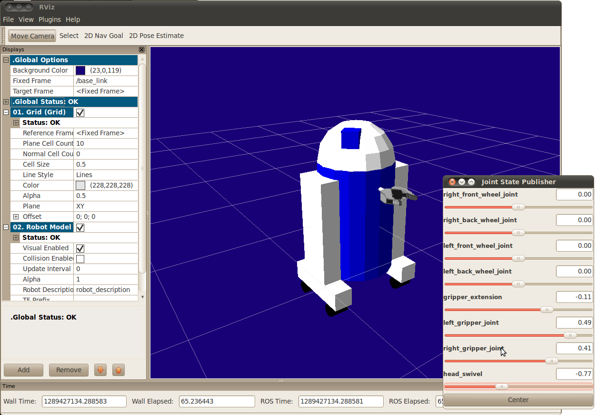
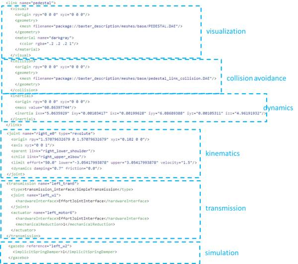

# 简介
URDF（Unified Robot Description Format）是ROS中使用的一种机器人描述文件，它以HTML的形式定义一个机器人。包含的内容有：连杆、关节名称，运动学参数、动力学参数、可视化模型、碰撞检测模型等。
<!-- more -->

# 参考链接
1. <http://wiki.ros.org/urdf>
1. <http://wiki.ros.org/urdf/Tutorials>
1. <http://www.vccoo.com/v/e418b9?source=rss>

# 参考教程
1.  [TF2教程](../tf2学习/)
1. Xacro教程
1. Gazebo教程

# URDF基础
## [使用URDF语言创建可视的模型](http://wiki.ros.org/urdf/Tutorials/Building%20a%20Visual%20Robot%20Model%20with%20URDF%20from%20Scratch)
1. 本教程使用URDF创建一个可视的模型，首先确保已经安装了Package:"joint_state_publisher"(使用rosdep安装，或使用apt-get安装urdf_tutorial)
1. 一个URDF文件中，有一个`<robot name="">`标签
1. 有多个`<link name="">`标签，表示机器人实体部件
1. 有多个`<joint name="" type="">`标签，表示机器人实体部件的连接（关节）
1. 在URDF以树结构保存机器人模型，具有一个根link
1. 在rviz中查看

	```
	$ roslaunch urdf_tutorial display.launch model:=urdf/01-myfirst.urdf
	```
	代码完成的事情包括：
	1. 将urdf/01-myfirst.urdf文件中的urdf模型载入ros parameter server
	1. 启动Node发布消息到sensor_msgs/JointState主题，以及发布transform消息
	1. 启动RVIZ
1. 可视化展示URDF树结构

	```
	$ urdf_to_graphiz my_robot.urdf
	$ evince test_robot.pdf
	```

1. 示例代码([source](https://github.com/ros/urdf_tutorial/blob/master/urdf_tutorial/urdf/05-visual.urdf))

	```
	<?xml version="1.0"?>
	<robot name="visual">
			<!-- 自定义材料属性 -->
			<!-- 也可以自定义图片纹理属性 -->
	    <material name="blue">
	    <color rgba="0 0 0.8 1" />
	    </material>
	    <link name="right_leg"><!-- link表示机器人实体部件 -->
	        <visual><!-- 实体部件的视觉设置 -->
	            <geometry>
	                <cylinder length="0.6" radius="0.2"/><!-- 长0.6m，班级0.2米的圆柱体 -->
	            </geometry>
	            <origin rpy="0 1.57075 0" xyz="0 0 -0.3" /><!-- 实体部件的坐标 --><!--rpy:roll pitch yaw-->
	            <!-- 部件向z轴移动-0.3m,沿y轴旋转PI/2 -->
	            <material name="white" />
	        </visual>
	    </link>
	    <joint name="base_to_right_leg" type="fixed"><!-- joint表示机器人实体部件的连接(关节) -->
	    <!-- joint类型可以是"fixed","continuous","revolute","prismatic" -->
	        <parent link="base_link" /><!-- joint连接两个实体部件，在URDF树上形成父子关系 -->
	        <child link="right_leg" />
	        <origin xyz="0 -0.22 0.25" />
	        <!-- 关节向y、z轴分别移动-0.22m、0.25m -->
	    </joint>
	    <link name="left_gripper">
	        <visual>
	            <origin rpy="0.0 0 0" xyz="0 0 0" />
	            <geometry>
	                <mesh filename="package://urdf_tutorial/meshes/l_finger.dae" /><!-- 实体部件外形可以导入外部模型文件 -->
	            </geometry>
	        </visual>
	    </link>
	    <joint name="left_tip_joint" type="fixed">
	        <parent link="left_gripper" />
	        <child link="left_tip" />
	    </joint>
	</robot>
	```
1. 外部导入网格模型
	1. URDF支持DAE、STL、TIF等外部网格模型
	1. DAE模型可以定义颜色，因此可以不用在URDF文件中指定颜色或材质

## 使用sw2urdf从Solidworks中导出模型
1. 下载sw2urdf安装
1. 参考官方文档，在Solidworks中进行操作并导出（假设为urdf-test）
1. sw2urdf导出的是package包，将导出的package包复制到/opt/ros/kinetic/share目录（echo $ROS_PACKAGE_PATH）
1. 进入导出的urdf目录。roscd urdf-
1. 执行roslaunch。roslaunch urdf_tutorial display.launch model:=urdf/urdf-testt.urdf

## [创建可移动的URDF模型](http://wiki.ros.org/urdf/Tutorials/Building%20a%20Movable%20Robot%20Model%20with%20URDF)

### 代码说明
1. 在上一节基础上修改URDF文件的joint节点([source](https://github.com/ros/urdf_tutorial/tree/master/urdf_tutorial/urdf/06-flexible.urdf))
1. 运行效果

	```
	roslaunch urdf_tutorial display.launch model:=urdf/06-flexible.urdf gui:=true
	```
	
1. joint类型说明：
	1. continuous:可以从负无穷到正无穷的任意角度变化。相对于fixed，需要axis标签说明旋转轴
	1. revolute:效果和continuous类似，但是具有严格的旋转范围限制，出axis标签外，还需要limit标签的upper、lower限定最大、最小旋转角度（单位：弧度），effort、velocity限定最大旋转力矩、旋转速度
	1. prismatic:prismatic是平行移动关节，关节沿axis周平行移动，而不是沿轴旋转。因为prismatic是平行移动，因此可以用于产生伸缩效果。limit标签内容和revolute类似，差别是在prismatic中的**单位是米**
	1. 其他joint：planar——可沿平面平行移动（prismatic只能沿一个轴移动）；floating——浮动关节，可以沿着三维空间任意方向移动
1. **continuous**示例代码

	```
	<joint name="head_swivel" type="continuous">
    <parent link="base_link"/>
    <child link="head"/>
    <axis xyz="0 0 1"/>
    <origin xyz="0 0 0.3"/>
  </joint>
	```
1. **revolute**示例代码
	
	```
	<joint name="left_gripper_joint" type="revolute">
    <axis xyz="0 0 1"/>
    <limit effort="1000.0" lower="0.0" upper="0.548" velocity="0.5"/>
    <origin rpy="0 0 0" xyz="0.2 0.01 0"/>
    <parent link="gripper_pole"/>
    <child link="left_gripper"/>
  </joint>
	```
2. **prismatic**示例代码

	```
	<joint name="gripper_extension" type="prismatic">
    <parent link="base_link"/>
    <child link="gripper_pole"/>
    <limit effort="1000.0" lower="-0.38" upper="0" velocity="0.5"/>
    <origin rpy="0 0 0" xyz="0.19 0 0.2"/>
  </joint>
	```

### RVIZ中URDF模型控制原理
1. rviz首先解析URDF文件，并查找到所有非fixed的关节及限制参数
1. 将滑块数据广播到sensor_msgs/JointState中
1. 然后使用robot_state_publisher来计算所有的坐标变换
1. 计算结果用于在rviz中进行显示

### 手动创建URDF文件
#### URDF文件书写格式

urdf模型中，包括：连杆link、关节joint、运动学参数axis、动力学参数dynamics、可视化模型visual、碰撞检测模型collision等。
